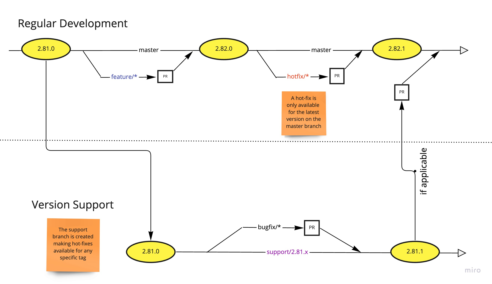

## Contributing

Before starting any change, read and follow the repository coding standards defined in [CODING_RULES_COPILOT.md](CODING_RULES_COPILOT.md). If a change intentionally deviates from a rule, document the rationale in your PR under an "Rule Deviations" section.

You are welcome to provide bug fixes and new features in the form of pull requests. If you'd like to contribute, please be mindful of the following guidelines:

- All changes should be properly tested for common scenarios (i.e. if changing Legal Entity SAGA, test that your change doesn't affect in non-intended ways to LE ingestion and update).
- Try to avoid reformat of files that change the indentation, tabs to spaces etc., as this makes reviewing diffs much more difficult.
- Please make one change/feature per pull request.
- Use descriptive PR description and commit messages.
- Together with your changes, submit updated [CHANGELOG.md](CHANGELOG.md) in your PR using the next desired version as reference.
- Get appropriate permissions to push to the repository by updating your **public** github username (not the EMU one) on [BambooHR](https://backbase.bamboohr.com/) (My Info -> Personal -> Contact -> GitHub Username)
- After your pull request gets approved and integrated, then **GitHub actions will bump** the `MINOR` version and deploy it to Backbase maven repository. *(e.g. 2.45.0 -> 2.46.0)*
    * For small fixes and patches utilize the `hotfix/` branch prefix, so once it is integrated the pipelines will automatically bump the `PATCH` version instead of the `MINOR`. *(e.g. 2.46.0 -> 2.46.1)*
    * Always use `hotfix/` branches for creating PRs to [`support/` branches](https://gitversion.net/docs/learn/branching-strategies/gitflow/examples#support-branches).
### Support Branch Example
#### Create support branch
```shell
# checkout tag 2.45.0
git checkout tags/2.45.0

# create new support branch form the above tag
git checkout -b support/2.45.x

# set upstream branch
git push --set-upstream origin  support/2.45.x

# push support branch
git push 
```

#### Create hotfix branch for your support branch then update your changes and create a Pull Request `hotfix/<hotfix-branch-name> -> support/2.45.x`

```shell
git checkout support/2.45.x
git checkout -b hotfix/<hotfix-branch-name>
```
> **NO!!** 
> 
> I know what you are thinking...
> 
> The `.x` in the support branch name **IS NOT** an "intuitive" documentation placeholder!
> 
> Please do not hardcode the patch version in the name of the support branch, it is supposed to be flexible to receive multiples patches, hence why keep the `.x` in its name.

### Branching Strategy Flow


#### For more information checkout [support-branches](https://gitversion.net/docs/learn/branching-strategies/gitflow/examples#support-branches)
