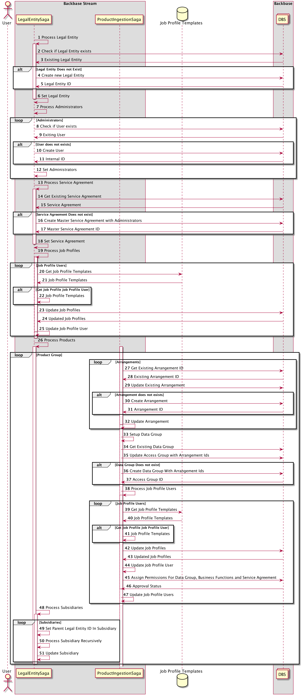

# Legal Entity Ingestion SAGA

The Legal Entity API can be used to quickly onboard Customers into Backbase DBS by orchestrating the required REST calls on the Backbase DBS Services.

The API uses a special Ingestion Model which is an aggregate of all objects necessary to create a Legal Entity and their supporting objects:

* Legal Entity
* Users able to login on behalf of this Legal Entity
* Service Agreement setup between the users and the Legal Entity
* Job Profile Templates containing Business Functions, Privileges and Limits to be applied between user and service agreement
* Grouped Arrangements with Job Profile Templates for assigned users

## How it works

The Legal Entity Saga orchestrates calls to Backbase DBS using information pass in the Legal Entity Ingestion Model. 



Communication to DBS is handled through the generated clients from `stream-dbs-cleints`


## Usage

The Legal Entity Saga can be used in several ways:

* **HTTP REST** - Adhoc processing of Legal Entities
* **Spring Cloud Data Flow Task** - Bootstrap Legal Entity Hierarchy from configuration
* **Spring Cloud Data Flow Sink** - Spring Cloud Stream Input Channel for continuously processing Legal Entities
* **Library** - Java Library used in All-in-one services 

### Example Configurations
The following configuration shows the required properties for Stream Legal Entity service

```yaml
spring:
  security:
    oauth2:
      client:
        provider:
          dbs:
            token-uri: http://token-converter:8080/oauth/token
        registration:
          dbs:
            authorization-grant-type: client_credentials
            client-id: bb-client
            client-secret: bb-secret
            client-authentication-method: post

backbase:
  stream:
    dbs:
      user-manager-base-url: http://user-manager:8080
      access-control-base-url: http://access-control:8080
      arrangement-manager-base-url: http://arrangement-manager:8080
      transaction-manager-base-url: http://transaction-manager:8080
      limit-manager-base-url: http://limits-manager:8080
```

## Legal Entity Bootstrap

For the initial ingestion of the Legal Entity, you can use the Spring Boot Task `legal-entity-bootstrap-task`. 

Examples and usage instructions can be found in the [readme.md](legal-entity-bootstrap-task/readme.md).


## Legal Entity HTTP

For processes that require an HTTP endpoint for ingestion of Legal Entities, the Legal Entity HTTP Service be deployed. 
The Legal Entity HTTP Service can be used to ingest Legal Entities both synchronously and asynchronously.

Examples and usage instructions can be found in the [readme.md](legal-entity-http/readme.md).


## Legal Entity Sink

The Legal Entity Sink can be used in Spring Cloud Data Flow and serve as a Sink to Ingest Legal Entities. 

Examples and usage instructions can be found in the [readme.md](legal-entity-sink/readme.md). 